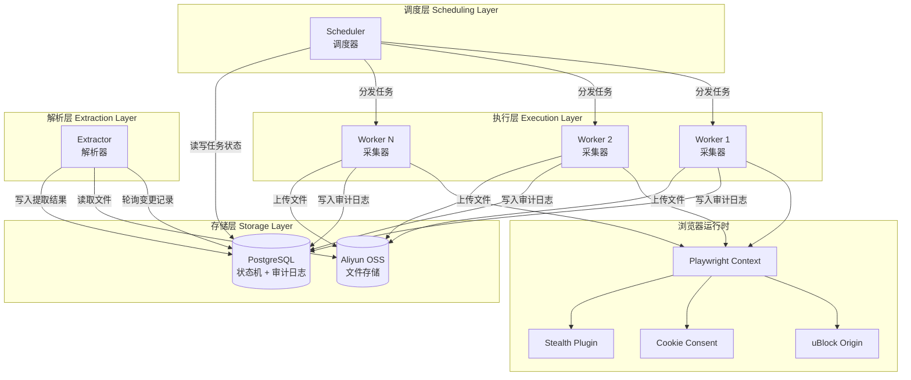
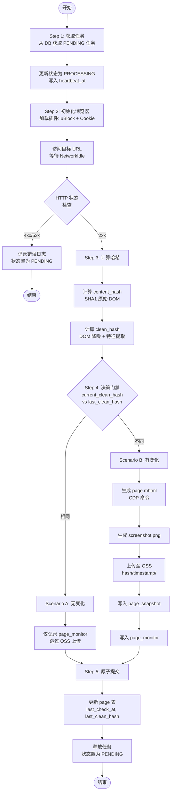
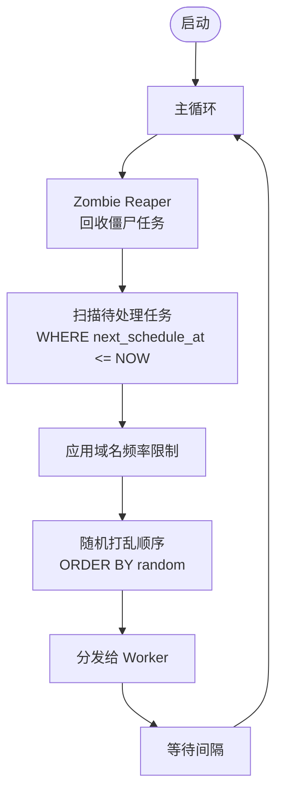
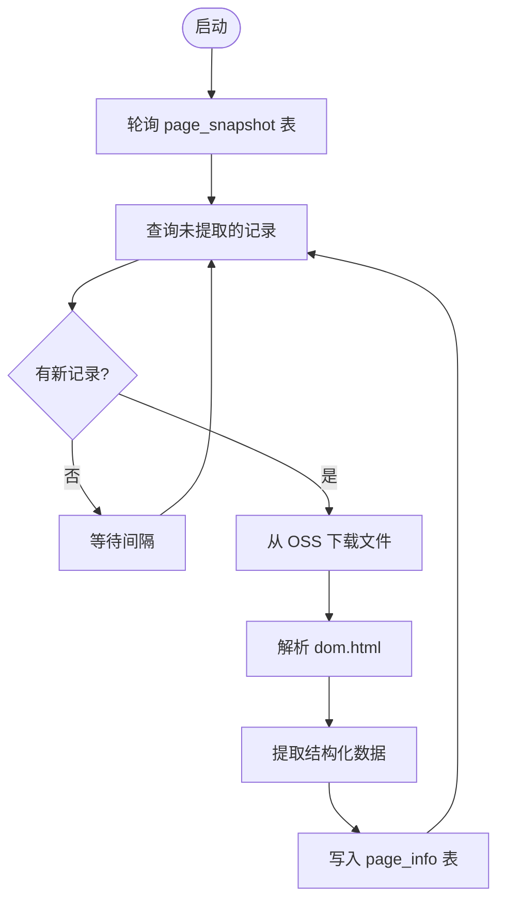
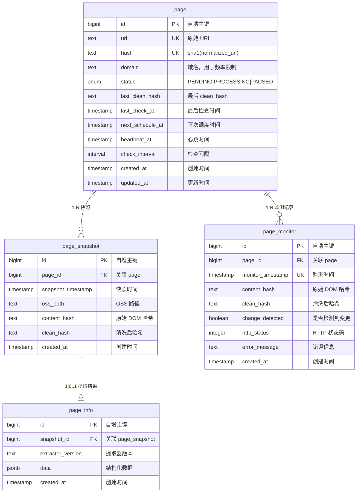
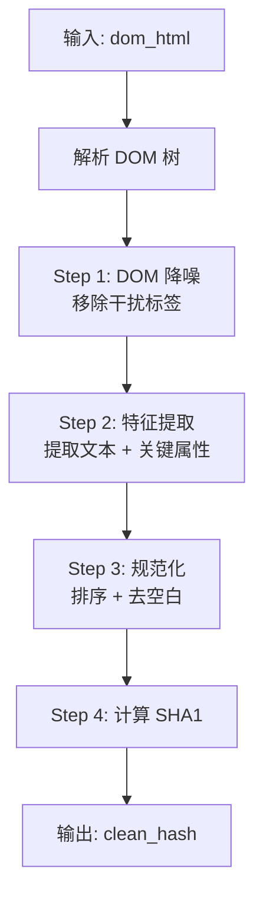

# Talemon 可溯源网络数据采集平台 - 技术规格说明书 (SPEC)

> **版本**: 1.0  
> **日期**: 2025-12-06  
> **基于**: PRD.md

---

## 1. 系统架构设计

### 1.1 整体架构图



### 1.2 组件职责说明

| 组件 | 职责 | 关键特性 |
|-----|------|---------
| **Scheduler** | 任务生产、Crash 恢复、全局流控 | 周期性扫描、Zombie Reaper |
| **Worker** | 执行浏览器操作、计算 Hash、OSS 上传 | 幂等执行、心跳汇报 |
| **Extractor** | 从 OSS 提取结构化数据 | 轮询驱动、异步处理 |
| **PostgreSQL** | 状态机、任务队列、审计日志 | SSOT、事务保证 |
| **Aliyun OSS** | 存储 DOM、截图、MHTML | CAS 模式、版本化路径 |

---

## 2. 核心调用流程

### 2.1 Worker 主流程图



### 2.2 Scheduler 调度流程



### 2.3 Extractor 解析流程



---

## 3. 数据库详细设计

### 3.1 表结构概览

| 表名 | 职责 | 唯一约束 |
|-----|------|---------
| **page** | URL 资产与调度状态 | `uk(url)`, `uk(hash)` |
| **page_snapshot** | 快照存档 (仅变更时写入) | `uk(page_id, clean_hash)`, `uk(page_id, snapshot_timestamp)` |
| **page_info** | 提取结果 | `uk(snapshot_id, extractor_version)` |
| **page_monitor** | 监测审计日志 (每次都写入) | `uk(page_id, monitor_timestamp)` |

### 3.2 ER 关系图



### 3.3 详细字段说明

#### 3.3.1 `page` 表 (资产与状态表)

| 字段 | 类型 | 约束 | 说明 |
|------|------|------|------|
| `id` | BIGSERIAL | PK | 自增主键 |
| `url` | TEXT | NOT NULL, UK | 原始 URL |
| `hash` | TEXT | NOT NULL, UK | `sha1(url)` |
| `domain` | TEXT | NOT NULL | 域名，用于频率限制 |
| `status` | ENUM | NOT NULL, DEFAULT 'PENDING' | `PENDING`, `PROCESSING`, `PAUSED` |
| `last_clean_hash` | TEXT | | 最后一次 clean_hash，用于快速比对 |
| `last_check_at` | TIMESTAMPTZ | | 最后检查时间 |
| `next_schedule_at` | TIMESTAMPTZ | NOT NULL, DEFAULT NOW() | 下次调度时间 |
| `heartbeat_at` | TIMESTAMPTZ | | 心跳时间，用于僵尸检测 |
| `check_interval` | INTERVAL | NOT NULL, DEFAULT '1 hour' | 检查间隔 |
| `created_at` | TIMESTAMPTZ | NOT NULL, DEFAULT NOW() | 创建时间 |
| `updated_at` | TIMESTAMPTZ | NOT NULL, DEFAULT NOW() | 更新时间 (触发器自动更新) |

#### 3.3.2 `page_snapshot` 表 (快照存档表)

| 字段 | 类型 | 约束 | 说明 |
|------|------|------|------|
| `id` | BIGSERIAL | PK | 自增主键 |
| `page_id` | BIGINT | NOT NULL, FK | 关联 page |
| `snapshot_timestamp` | TIMESTAMPTZ | NOT NULL | 快照时间 `{YYMMDD.hhmmss}` |
| `oss_path` | TEXT | NOT NULL | OSS 路径: `{hash}/{timestamp}/` |
| `content_hash` | TEXT | NOT NULL | 原始 DOM 哈希 SHA1 |
| `clean_hash` | TEXT | NOT NULL | 清洗后哈希 SHA1 |
| `created_at` | TIMESTAMPTZ | NOT NULL, DEFAULT NOW() | 创建时间 |

**唯一约束说明**:
- `uk(page_id, clean_hash)`: 逻辑去重，同一内容不重复存储
- `uk(page_id, snapshot_timestamp)`: 物理对应 OSS 路径，便于 clean_hash 算法升级

#### 3.3.3 `page_info` 表 (提取结果表)

| 字段 | 类型 | 约束 | 说明 |
|------|------|------|------|
| `id` | BIGSERIAL | PK | 自增主键 |
| `snapshot_id` | BIGINT | NOT NULL, FK | 关联 page_snapshot |
| `extractor_version` | TEXT | NOT NULL | 提取器版本 |
| `data` | JSONB | NOT NULL | 提取后的结构化数据 |
| `created_at` | TIMESTAMPTZ | NOT NULL, DEFAULT NOW() | 创建时间 |

#### 3.3.4 `page_monitor` 表 (监测审计日志表)

| 字段 | 类型 | 约束 | 说明 |
|------|------|------|------|
| `id` | BIGSERIAL | PK | 自增主键 |
| `page_id` | BIGINT | NOT NULL, FK | 关联 page |
| `monitor_timestamp` | TIMESTAMPTZ | NOT NULL | 监测时间 `{YYMMDD.hhmmss}` |
| `content_hash` | TEXT | | 原始 DOM 哈希 (可能为空，如请求失败) |
| `clean_hash` | TEXT | | 清洗后哈希 (可能为空) |
| `change_detected` | BOOLEAN | NOT NULL, DEFAULT FALSE | 是否检测到变更 |
| `http_status` | INTEGER | | HTTP 状态码 |
| `error_message` | TEXT | | 错误信息 |
| `created_at` | TIMESTAMPTZ | NOT NULL, DEFAULT NOW() | 创建时间 |

### 3.4 索引策略

```sql
-- page 表索引
CREATE INDEX idx_page_status_schedule ON page(status, next_schedule_at) 
    WHERE status = 'PENDING';           -- 调度器获取待处理任务
CREATE INDEX idx_page_domain ON page(domain);   -- 域名频率限制
CREATE INDEX idx_page_heartbeat ON page(heartbeat_at) 
    WHERE status = 'PROCESSING';        -- 僵尸检测

-- page_snapshot 表索引
CREATE INDEX idx_snapshot_page ON page_snapshot(page_id);
CREATE INDEX idx_snapshot_time ON page_snapshot(snapshot_timestamp DESC);

-- page_info 表索引
CREATE INDEX idx_info_snapshot ON page_info(snapshot_id);
CREATE INDEX idx_info_data ON page_info USING GIN (data);  -- JSONB 索引

-- page_monitor 表索引
CREATE INDEX idx_monitor_page_time ON page_monitor(page_id, monitor_timestamp DESC);
CREATE INDEX idx_monitor_change ON page_monitor(change_detected) 
    WHERE change_detected = true;       -- 查询变更记录
```

### 3.5 常用 SQL 示例

```sql
-- 1. 调度器获取待处理任务 (乱序 + 域名频控)
SELECT id, url, hash, domain
FROM page
WHERE status = 'PENDING'
  AND next_schedule_at <= NOW()
ORDER BY random()
LIMIT 100
FOR UPDATE SKIP LOCKED;

-- 2. 僵尸任务回收
UPDATE page
SET status = 'PENDING', heartbeat_at = NULL
WHERE status = 'PROCESSING'
  AND heartbeat_at < NOW() - INTERVAL '5 minutes';

-- 3. Worker 更新心跳
UPDATE page
SET heartbeat_at = NOW()
WHERE id = :page_id AND status = 'PROCESSING';

-- 4. 检查 clean_hash 是否变更
SELECT last_clean_hash
FROM page
WHERE id = :page_id;

-- 5. 插入快照记录 (使用 ON CONFLICT 防止重复)
INSERT INTO page_snapshot (page_id, snapshot_timestamp, oss_path, content_hash, clean_hash)
VALUES (:page_id, :timestamp, :oss_path, :content_hash, :clean_hash)
ON CONFLICT (page_id, clean_hash) DO NOTHING;

-- 6. Extractor 查询待提取的快照
SELECT s.id, s.oss_path, s.clean_hash, p.url
FROM page_snapshot s
JOIN page p ON s.page_id = p.id
LEFT JOIN page_info i ON s.id = i.snapshot_id AND i.extractor_version = :version
WHERE i.id IS NULL
LIMIT 50;
```

---

## 4. 算法设计

### 4.1 Clean Hash 算法

Clean Hash 是核心去重算法，用于判断页面是否发生实质性变化。

#### 4.1.1 算法目标

- **去除噪音**: 广告、脚本、样式等动态内容不影响哈希
- **保留核心**: 可见文本和关键链接作为指纹
- **稳定可重入**: 相同内容多次计算结果一致

#### 4.1.2 算法流程



#### 4.1.3 详细步骤

**Step 1: DOM 降噪**

移除以下标签及其内容:
```python
STRIP_TAGS = ["script", "style", "iframe", "noscript", "meta", "link", "svg"]
```

移除广告容器 (插件可能漏掉的):
```python
AD_SELECTORS = [
    ".ad", ".ads", ".advertisement",
    "[id*='ad-']", "[class*='ad-']",
    ".sponsored", ".promo"
]
```

**Step 2: 特征提取**

提取两类信息:
1. **可见文本**: 所有文本节点的内容
2. **关键属性**: 
   - `<a>` 标签的 `href`
   - `` 标签的 `src` 和 `alt`
   - 其他元素的 `title`

```python
EXTRACT_ATTRS = ["href", "src", "alt", "title"]
```

**Step 3: 规范化**

- 属性键值对按字母序排序
- 去除多余空白 (连续空格、制表符、换行)
- 统一编码为 UTF-8

**Step 4: 计算 SHA1**

```python
clean_hash = hashlib.sha1(normalized_content.encode('utf-8')).hexdigest()
```

#### 4.1.4 配置参考

见 `config/config.toml` 的 `[hasher]` 部分。

---

## 5. 存储设计

### 5.1 OSS 路径规范

```text
oss://<bucket>/data/{url_hash}/{YYMMDD.hhmmss}/
```

其中:
- `url_hash`: `sha1(normalized_url)`
- 时间戳格式: `%y%m%d.%H%M%S` (如 `251206.143025`)

### 5.2 文件清单

每次变更上传以下 4 个文件:

| 文件名 | 说明 |
|--------|------|
| `dom.html` | 清洗后的 DOM，用于提取与比对 |
| `source.html` | 原始响应文本 |
| `page.mhtml` | **核心溯源凭证**，通过 CDP 生成的单文件档案 |
| `screenshot.png` | 全屏可视化存证 |

### 5.3 写入策略

- **CAS 模式**: 仅当 `clean_hash` 变化时写入
- **写入顺序**: 先 OSS → 后 DB (保证数据一致性)
- **失败处理**: OSS 失败时 DB 不更新，等待 Zombie Reaper 回收重试

---

## 6. 浏览器运行时配置

### 6.1 Playwright 配置

- **Core**: Playwright (Python Async)
- **Context**: 必须使用 `launch_persistent_context` 以支持扩展加载

### 6.2 插件配置

| 插件 | 作用 |
|------|------|
| **uBlock Origin** | 屏蔽广告位、追踪脚本 |
| **I don't care about cookies** | 自动处理 GDPR/Cookie 弹窗 |
| **playwright-stealth** | 掩盖 WebDriver 特征 |

### 6.3 配置示例

```toml
[worker.browser]
headless = true
user_data_dir = "./data/browser_profile"
extensions_dir = "./config/extensions"
```

---

## 7. 代码组织结构

```text
talemon/
├── config/                          # 配置目录
│   ├── config.toml                  # 主配置文件 (非敏感)
│   └── extensions/                  # Chrome 扩展目录
│
├── src/                             # 源代码目录
│   ├── core/                        # 核心模块
│   │   ├── config.py                # 配置加载器
│   │   ├── database.py              # 数据库连接池
│   │   ├── oss.py                   # OSS 客户端封装
│   │   └── logging.py               # 日志配置
│   │
│   ├── models/                      # 数据模型
│   │   ├── schema.sql               # 数据库 Schema DDL
│   │   ├── page.py                  # Page 实体
│   │   ├── snapshot.py              # Snapshot 实体
│   │   ├── info.py                  # Info 实体
│   │   └── monitor.py               # Monitor 实体
│   │
│   ├── services/                    # 核心服务
│   │   ├── scheduler/               # 调度器服务
│   │   ├── worker/                  # 采集器服务
│   │   │   ├── browser.py           # Playwright 上下文管理
│   │   │   ├── hasher.py            # Clean Hash 算法
│   │   │   └── task.py              # 任务获取与提交
│   │   └── extractor/               # 解析器服务
│   │
│   └── utils/                       # 工具模块
│
├── tests/                           # 测试目录
├── scripts/                         # 运维脚本
├── docs/                            # 文档目录
├── .env.example                     # 环境变量模板
└── config/config.toml               # 配置文件
```

---

## 8. 配置设计

详见 `config/config.toml` 和 `.env.example`。

### 8.1 配置分离原则

| 配置类型 | 存放位置 | 示例 |
|----------|----------|------|
| 非敏感配置 | `config/config.toml` | 超时时间、批量大小、日志级别 |
| 敏感配置 | `.env` | 数据库密码、OSS 密钥 |

### 8.2 关键配置项

| 模块 | 配置项 | 默认值 | 说明 |
|------|--------|--------|------|
| scheduler | `zombie_timeout_seconds` | 300 | 心跳超时阈值 |
| worker | `heartbeat_interval_seconds` | 30 | 心跳上报间隔 |
| worker | `page_timeout_seconds` | 60 | 页面加载超时 |
| oss | `template` | `{url_hash}/{timestamp}/` | 路径模板 |
